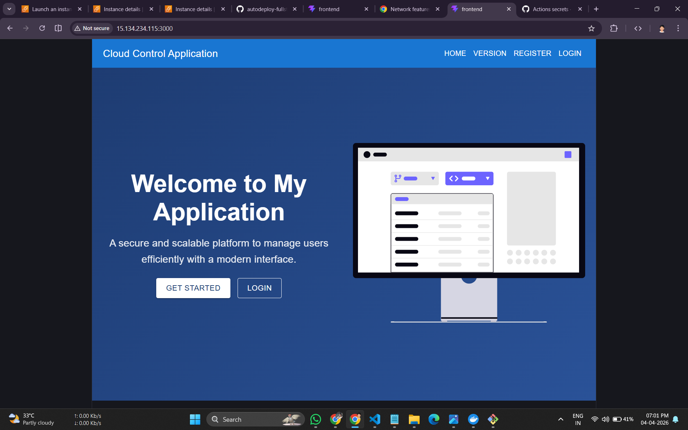
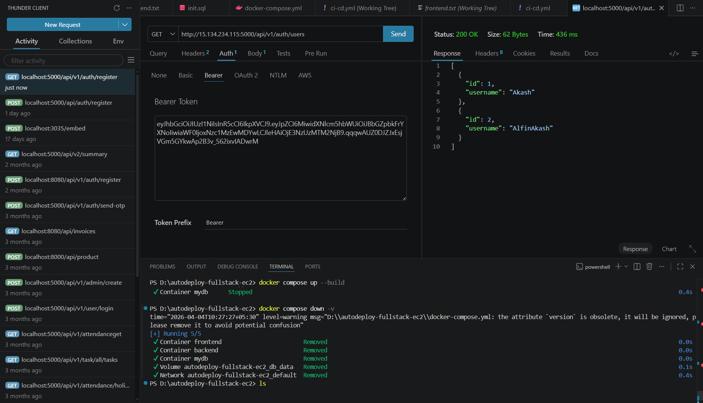
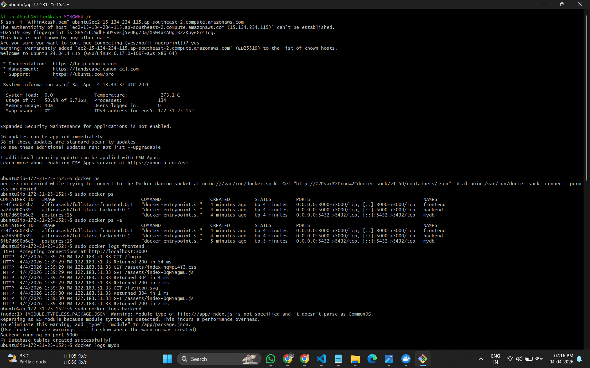

# Fullstack Docker CI/CD Deployment (Frontend + Backend + PostgreSQL)

## Project Overview

This project is a fullstack application deployed using:

- Frontend (React / Vite)
- Backend (Node.js / Express)
- Database (PostgreSQL)
- Docker (Containerization)
- GitHub Actions (CI/CD)
- AWS EC2 (Deployment Server)

---

## CI/CD Pipeline

The CI/CD pipeline automatically:

- Builds Docker images
- Pushes images to Docker Hub
- Connects to EC2 via SSH
- Pulls latest images
- Starts frontend, backend, and database containers

---

## Project Structure

```
project-root/
│
├── frontend/
├── backend/
├── app-version/
│   ├── frontend.txt
│   └── backend.txt
│
├── .github/workflows/
│   └── deploy.yml
│
├── docker-compose.yml (optional)
└── README.md
```

---

## Application Versioning

Instead of using `latest` Docker tag, this project uses version files.

### Version Files

```
app-version/frontend.txt
app-version/backend.txt
```

### Example

```
frontend.txt → 1.0
backend.txt → 1.0
```

Updating these versions triggers a new deployment.

---

## GitHub Secrets Required

Go to:

**GitHub → Repository → Settings → Secrets → Actions**

Add the following:

| Secret Name         | Description                     |
|--------------------|---------------------------------|
| DOCKER_USERNAME    | Docker Hub username             |
| DOCKER_TOKEN       | Docker Hub access token         |
| VITE_BACKEND_URL   | Backend public URL              |
| EC2_HOST           | EC2 public IP                   |
| EC2_USER           | EC2 username (ubuntu)           |
| EC2_SSH_KEY        | EC2 private SSH key             |
| DB_HOST            | Database host (mydb)            |
| DB_USER            | Database username               |
| DB_PASSWORD        | Database password               |
| DB_NAME            | Database name                   |
| JWT_SECRET         | JWT secret key                  |

---

## CI/CD Workflow

The GitHub Actions workflow performs:

1. Checkout repository
2. Read frontend & backend version
3. Login to Docker Hub
4. Build frontend Docker image
5. Build backend Docker image
6. Push images to Docker Hub
7. SSH into EC2 server
8. Pull new images
9. Stop old containers
10. Start database container
11. Start backend container
12. Start frontend container

---

## Deployment Architecture

```
User Browser
      ↓
Frontend Container (Port 3000)
      ↓
Backend Container (Port 5000)
      ↓
PostgreSQL Container (Port 5432)
```

All containers run inside Docker network:

```
fullstack-net
```

---

## Docker Network

| Service   | Hostname |
|----------|---------|
| Database | mydb    |
| Backend  | backend |
| Frontend | frontend|

---

## Backend Configuration

```
DB_HOST=mydb
DB_USER=postgres
DB_PASSWORD=******
DB_NAME=mydb
DB_PORT=5432
PORT=5000
JWT_SECRET=******
```

---

## Frontend Configuration

```
VITE_BACKEND_URL=http://EC2_PUBLIC_IP:5000
```

---

## Deployment Steps

### Step 1 — Update Version

```
app-version/frontend.txt
app-version/backend.txt
```

Example:

```
1.1
```

### Step 2 — Commit & Push

```
git add .
git commit -m "Deploy new version"
git push origin main
```

### Step 3 — GitHub Actions Runs

Pipeline will:

- Build images
- Push to Docker Hub
- Deploy to EC2
- Restart containers

---

## Useful Docker Commands (EC2)

### Check running containers
```
sudo docker ps
```

### View logs
```
sudo docker logs backend
sudo docker logs frontend
sudo docker logs mydb
```

### Access containers
```
sudo docker exec -it backend sh
sudo docker exec -it mydb psql -U postgres -d mydb
```

### Check network
```
sudo docker network inspect fullstack-net
```

---

## Application URLs

| Service   | URL                     |
|----------|--------------------------|
| Frontend | http://EC2_IP:3000       |
| Backend  | http://EC2_IP:5000       |
| Database | Port 5432               |

---

## Database Tables

Example:

- users
- posts

Check tables:

```
sudo docker exec -it mydb psql -U postgres -d mydb -c "\dt"
```

---

## Common Issues & Fixes

### Backend not connecting to DB

Ensure:
```
DB_HOST=mydb
```

### Frontend cannot call backend

Check:
```
VITE_BACKEND_URL
```

### Backend API not reachable

Ensure server runs on:
```
app.listen(5000, "0.0.0.0")
```

---

## Technologies Used

- React / Vite
- Node.js / Express
- PostgreSQL
- Docker
- GitHub Actions
- AWS EC2
- Docker Hub
- CI/CD Pipeline

---

## Final Deployment Flow

```
Developer Push → GitHub
        ↓
GitHub Actions Build Docker Images
        ↓
Push Images to Docker Hub
        ↓
SSH into EC2
        ↓
Pull New Images
        ↓
Start Database
        ↓
Start Backend
        ↓
Start Frontend
        ↓
Application Live
```


---


## Results (Deployment Proof)

### Frontend Output


### Backend API Response


### Terminal Deployment Logs

